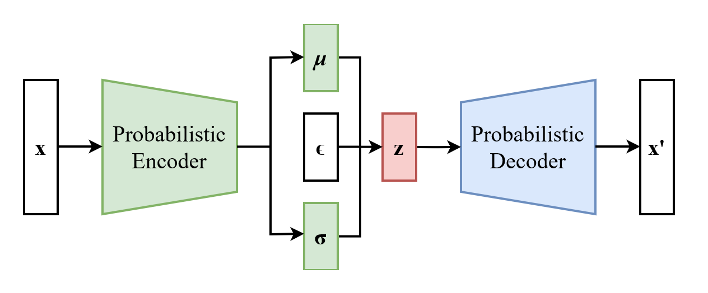

# Generative VQ-VAE Model on HipMRI Prostate Cancer Dataset
### Author: s4743500, Aidan Lok, University of Queensland

## Project Overview 
This project aims to develop a generative model for the HipMRI Study on Prostate Cancer dataset using a **Vector Quantized Variational Autoencoder (VQ-VAE)** model. VQ-VAE models are trained to learn a discrete latent representation of the MRI data, which is then used to create realistic prostate MRI images. 

The main purpose of this project is to improve upon the limitations of a standard Variational Autoencoder (VAE) where they would typically struggle to generate high-quality medical images. This is because VAE's learn to represent data in a continuous latent space which makes it difficult to encode precise and detailed features. As a result, VAEs suffer from issues like blurriness and lack of detail in the reconstructed images [[1]](#1).  

  

On the other hand, VQ-VAEs uses discrete latent variabes instead of continuous ones by incorporating vector quantization. This creates clearer and better image reconstructions. Refering to the image below [[2]](#2), it shows a simple illustration of a VQ-VAE architecture. The data flow through a VQ-VAE model is made up of 5 key components:    
&nbsp;&nbsp;&nbsp;&nbsp;1. Encoder  
&nbsp;&nbsp;&nbsp;&nbsp;2. Embedding Space  
&nbsp;&nbsp;&nbsp;&nbsp;3. Quantization  
&nbsp;&nbsp;&nbsp;&nbsp;4. Decoder  
&nbsp;&nbsp;&nbsp;&nbsp;5. Training Signal (Backpropagation Path)  

  

Firstly, the process starts with an input image being **encoded** into a latent representation using a convolutional neural network (CNN). This CNN maps the image to a latent representation denoted as \( z_e(x) \), where each spatial location of the latent map is transformed into a vector representing the features of that region. The latent representation is then quantized using a set of discrete embedding vectors stored in an **embedding space**. The **quantization** process involves mapping each vector in the latent representation to its closest embedding vector in the codebook. This quantized representation, \( z_q(x) \), is passed to the **decoder** (which is another CNN) where its job is to reconstruct the image from its compressed representation. The output of the decoder is an approximation of what it thinks the original input looked like \( p(x \mid z_q) \). Furthermore, the red arrow in the image indicates the gradient flow used for training. During training, **backpropogration** is perfored to continually update the encoder and embedding vectors in order to try minimise the reconstruction loss.  

### Deep learning pipeline  
The following sections provide an overview of the deep learning pipeline used for this project:  
&nbsp;&nbsp;&nbsp;&nbsp; 1. Data Loading & Preprocessing  
&nbsp;&nbsp;&nbsp;&nbsp; 2. Model Architecture  
&nbsp;&nbsp;&nbsp;&nbsp; 3. Training Procedure  
&nbsp;&nbsp;&nbsp;&nbsp; 4. Testing procedure  

## 1. Data Loading & Preprocessing  
The dataset used for this project was the Prostate 2D HipMRI dataset which can be found and downloaded [[here]](#here). The images consists of grayscale MRI scans of prostate tissue which was loaded and preprocessed using the custom data loader found in the [dataset.py](dataset.py) file.    

### Dataset Description  
The MRI images are stored in NIfTI (.nii or .nii.gz) format, and it was split into training, validation, and test datasets:  
  
Number of training images: 11460  
Number of validation images: 660  
Number of testing images: 540  
  
which corresponds to approximately 90% of the data being used for training, 6% for validation, and the remaining 4% for testing. These split percentages allow us to effectively train the data while maintaining a validation and testing set to evaluate the model's ability to generalise unseen data. Therefore, no form of data augmentation was performed as I believed the dataset size was sufficient. 

### Data Pipeline  
The following transformations were applied to the dataset before feeding it into the model:  
  
`transform = transforms.Compose([`  
&nbsp;&nbsp;&nbsp;&nbsp;`transforms.Resize((image_size, image_size)),`   
&nbsp;&nbsp;&nbsp;&nbsp;`transforms.Grayscale(num_output_channels=1),`   
&nbsp;&nbsp;&nbsp;&nbsp;`transforms.ToTensor(),`  
&nbsp;&nbsp;&nbsp;&nbsp;`transforms.Normalize((0.5,), (0.5,))`   
`])`  
  
The images were resized to 256x256 pixels to make sure all images had the same input size. Moreover, to improve training stability, the pixel values for each image were normalized to the range [-1, 1]. Because the images only have one colour channel representing the intensity of the pixels (grayscale images), each image is converted to a single-channel grayscale image using  
  
`transforms.Grayscale(num_output_channels=1)`  
  
This was done to ensure that all images have the expected format (1 channel, grayscale).

### Data Loaders  
The dataset was loaded using PyTorch's DataLoader class within the `torch.utils.data` module. Shuffling was enabled for the training data so that the model did not learn from any specific order of images, which could have led to some form of bias. Three DataLoaders were created for the individual datasets (train, validation, and test dataset):  
  
`train_loader = DataLoader(train_dataset, batch_size=batch_size, shuffle=True, num_workers=1)`  
`val_loader = DataLoader(val_dataset, batch_size=batch_size, shuffle=False, num_workers=1)`  
`test_loader = DataLoader(test_dataset, batch_size=batch_size, shuffle=False, num_workers=1)`  
  
## 2. Model Architecture  

## Reference List  
<a name="1">[1]</a> What is VQ-VAE (Vector Quantized Variational Autoencoder): [https://www.activeloop.ai/resources/glossary/vq-vae-vector-quantized-variational-autoencoder/#:~:text=The%20main%20difference%20between%20them,finite%20set%20of%20learned%20embeddings.](https://www.activeloop.ai/resources/glossary/vq-vae-vector-quantized-variational-autoencoder/#:~:text=The%20main%20difference%20between%20them,finite%20set%20of%20learned%20embeddings.)  
<a name="2">[2]</a> VQ-VAE Architecture Illustration: [https://arxiv.org/abs/1711.00937](https://arxiv.org/abs/1711.00937)  
<a name="here">[3]</a> 2D HipMRI slices: [https://filesender.aarnet.edu.au/?s=download&token=76f406fd-f55d-497a-a2ae-48767c8acea2](https://filesender.aarnet.edu.au/?s=download&token=76f406fd-f55d-497a-a2ae-48767c8acea2):